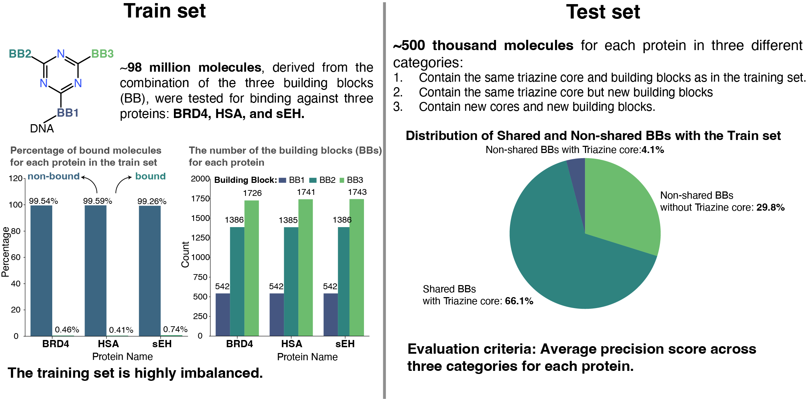

# Leash-BELKA
Models to participate the Leash-BELKA competion (**Ranked 122nd out of 1950 teams with Bronze medal**)

## **Competion objectives:**
Predict small molecule-protein interactions using the Big Encoded Library for Chemical Assessment 

## **Problem definition and exploratory data analysis**
