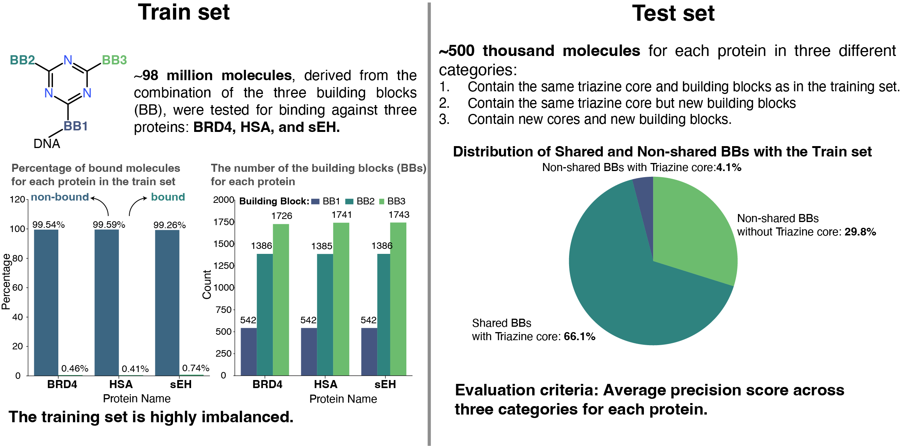
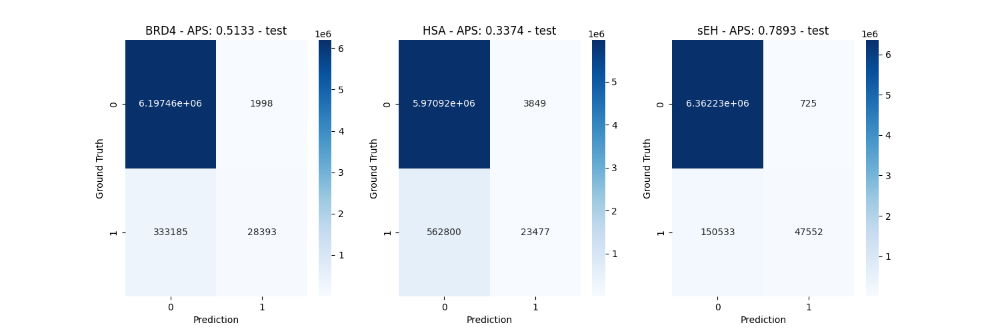

# Leash-BELKA
Models to participate the Leash-BELKA competion (**Ranked 122nd out of 1950 teams with Bronze medal**)

## **Competion objectives:**
Predict small molecule-protein interactions using the Big Encoded Library for Chemical Assessment 


## **Problem definition and exploratory data analysis**



## Installation
### General
```
conda create --name BELKA python=3.10
conda activate BELKA
bash install.sh
```

## Data
* Main data: `kaggle competitions download -c leash-BELKA -p`


## Model
### Combining XGBoost model and 1D CNN model 
#### XGBoost model: 
- XGboost/scr/train_XGboost_sEH.py
- XGboost/scr/train_XGboost_BRD4.py
- XGboost/scr/train_XGboost_HSA.py

#### 1D CNN
- 1D_CNN/scr/1D_CNN_train.py


## Result
### 1D CNN



*Submitted results
Public Leaderboard: 0.45582 (Rank 147)
Private Leaderboard: 0.25429 (Rank 122)

